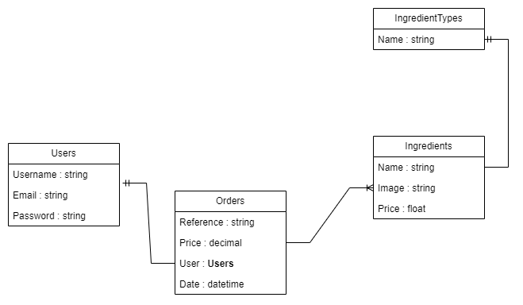
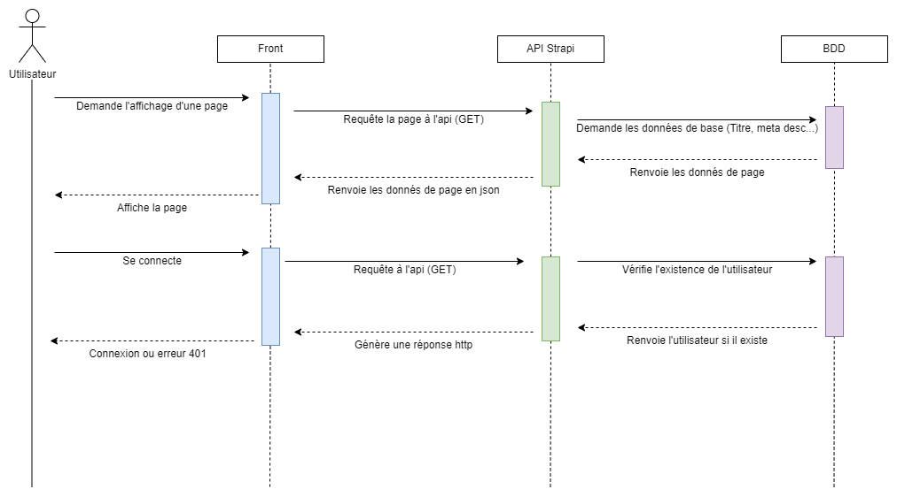
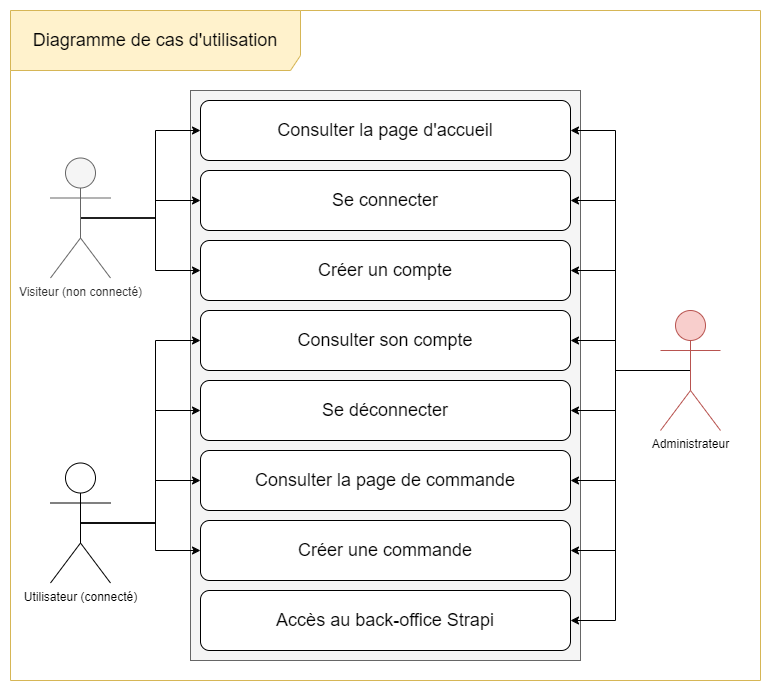

# Documentation application BurgerVerseOnline

# Sommaire
- [Documentation application BurgerVerseOnline](#documentation-application-burgerverseonline)
- [Sommaire](#sommaire)
- [Contexte et Description de l'application](#contexte-et-description-de-lapplication)
- [Conception](#conception)
  - [Diagramme de Données](#diagramme-de-données)
  - [Structure Strapi](#structure-strapi)
  - [Structure Front-End](#structure-front-end)
  - [Fonctionnement de l'application](#fonctionnement-de-lapplication)
    - [Diagramme de séquence](#diagramme-de-séquence)
    - [Diagramme de cas d'utilisation](#diagramme-de-cas-dutilisation)
- [~~Déploiement avec Docker~~](#déploiement-avec-docker)
  - [~~Prérequis~~](#prérequis)
  - [~~Déploiement avec Make~~](#déploiement-avec-make)
  - [~~Déploiement sans Make~~](#déploiement-sans-make)
- [Déploiement sans Docker](#déploiement-sans-docker)
  - [Prérequis](#prérequis-1)
  - [Déploiement](#déploiement)
    - [Récupérer le projet](#récupérer-le-projet)
    - [Strapi](#strapi)
    - [Front](#front)
- [Pages disponibles](#pages-disponibles)
- [Plugins Strapi utilisés](#plugins-strapi-utilisés)

# Contexte et Description de l'application

Il s'agit d'une application web fictive pour un exposé d'anglais dans lequel nous devons présenter une entreprise fictive. Nous avons décidé d'aller un peu plus loin et faire un site vitrine pour la solution de cette entreprise.
L'entreprise en question est BurgerVerseOnline, une chaine de restauration rapide fictive qui propose des burgers personnalisés à la commande.

Lors de la création d'une commande, on choisit nos ingrédients : pain, viandes, accompagnements etc..

# Conception

## Diagramme de Données

## Structure Strapi

<u>Collections:</u>
-   `IngredientTypes`: Catégories d'ingrédients (pain, viande, accompagnement etc..)
-   `Ingredient`: Ingrédients (contient le nom, l'image, le prix et la catégorie)
-   `Order`: Commandes (contient les ingrédients, le prix total, la date de création et l'utilisateur associé)
-   `User`: Collection user de base de Strapi, utilisée pour l'authentification

Les collections `IngredientTypes` et `Ingredient` sont liées par une relation 1:n, un type d'ingrédient peut avoir plusieurs ingrédients.

La collection `Order` est liée à la collection `User` par une relation 1:n, un utilisateur peut avoir plusieurs commandes.

La collection `Ingredient` est liée à la collection `Order` par une relation n:n, une commande peut avoir plusieurs ingrédients et un ingrédient peut être dans plusieurs commandes.

<u>Single:</u>
-  `Home`: Page d'accueil du site
-  `Login`: Page de connexion
-  `Register`: Page d'inscription
-  `Order`: Page de commande (Protégée par authentification)

<u>Components:</u>
-  `Menu`: Menu de navigation
-  `Footer`: Contient les champs spécifiques au footer (texte, liens etc..)
-  `Slider`: Champs contenant des textes et images

Les components sont utilisés dans les singles, pour le front-end du site, afin de créer des élements réutilisables.

## Structure Front-End

Le front-end est composé de 5 pages :
-  `Home`: Page d'accueil du site
-  `Login`: Page de connexion
-  `Register`: Page d'inscription
-  `Account`: Page de compte (Protégée par authentification)
-  `Order`: Page de commande (Protégée par authentification)

Le front est développé avec **Svelte**, un framework javascript.

<!-- #### **Diagramme de classe**

 -->

## Fonctionnement de l'application

### Diagramme de séquence

### Diagramme de cas d'utilisation

# ~~Déploiement avec Docker~~

## ~~Prérequis~~

- ~~Docker~~
- ~~Docker-compose (intégré à Docker sur Windows et Mac)~~
- ~~Make (optionnel)~~

## ~~Déploiement avec Make~~
~~Ouvrir un terminal à la racine de l'application et exécuter les commandes suivantes :~~

- ~~`make up` : Déploie l'application et la démarre~~
- ~~`make stop` : Arrête l'application~~
- ~~`make start` : Démarre l'application~~
- ~~`make remove` : Désinstalle et Supprime les données de l'application~~

## ~~Déploiement sans Make~~
~~Ouvrir un terminal à la racine de l'application et exécuter les commandes suivantes :~~

- ~~`docker compose up -d` : Déploie l'application~~
- ~~`docker compose stop` : Arrête l'application~~
- ~~`docker compose start` : Démarre l'application~~
- ~~`docker compose down -v --rmi local` : Supprime les données de l'application~~

# Déploiement sans Docker

__Note :__ <u>Exceptionnellement</u>, la bdd de Strapi et les fichiers d'environnement sont commités pour faciliter le déploiement.

## Prérequis

- NodeJS avec npm ou yarn

## Déploiement

### Récupérer le projet

Ouvrir un terminal et exécuter la commande suivante :
`git clone https://github.com/Goramax/StrapiHeadless.git`

### Strapi

Ouvrir un terminal à la racine du projet et exécuter les commandes suivantes :

- `cd strapi_01` : Se placer dans le dossier strapi_01
- `npm install` : Installer les dépendances
- `npm run build` : Compiler l'application
- `npm run start` : Démarre l'application en mode production

Ouvrir un navigateur et aller sur l'adresse `http://localhost:1337/admin` pour accéder à l'interface d'administration de Strapi.
L'identifiant du compte par dfaut est :
ID : `admin@admin.com`
Mot de passe : `Root1234`

### Front

Ouvrir un terminal à la racine du projet et exécuter les commandes suivantes :

- `cd front` : Se placer dans le dossier front
- `npm install` : Installer les dépendances
- `npm run build` : Compiler l'application
- Déployez ensuite le dossier `dist` généré par la commande précédente sur un serveur web (Apache, Nginx etc..)

Pour exécuter l'application en mode développement, exécuter la commande `npm run dev` à la place de `npm run build`.

- Ouvrir un navigateur et aller sur l'adresse `http://localhost:5173` pour accéder au site

# Pages disponibles

- `/` : **Page d'accueil** (Affichage)
- `/order` : **Page pour créer une commande** (Affichage / Création)
- `/order-confirm` : **Page de confirmation de commande** (Affichage)
- `/admin` : **Page d'affichage des commandes** (Modification / Suppression)

# Plugins Strapi utilisés

- [Advanced UUID](https://market.strapi.io/plugins/strapi-advanced-uuid)
